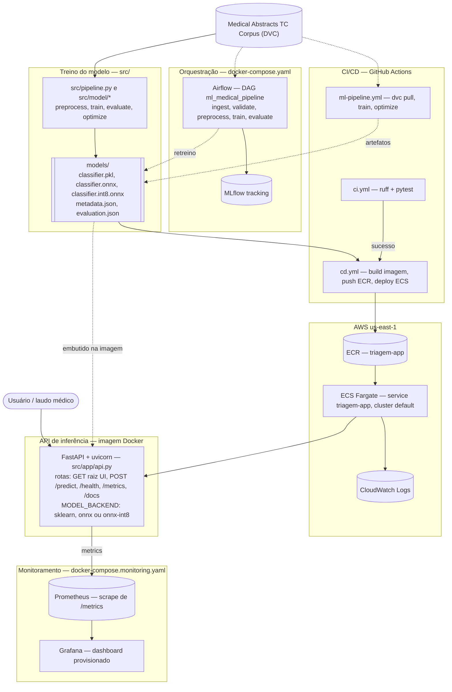

# 👩🏻‍💻 Projeto Tech Challenge Fase 3

[](https://github.com/LaraGSilva/projeto-tech-challenge-sistema-triagem/actions/workflows/ci.yml)
[](https://github.com/LaraGSilva/projeto-tech-challenge-sistema-triagem/actions/workflows/cd.yml)


## 🧑🏻‍⚕️ Sistema de triagem para inferência automática de laudos médicos

Este sistema de triagem automática de laudos médicos tem como principal objetivo atuar na categorização de doenças com base em laudos médicos textuais. O projeto foi desenvolvido com o intuito de ter uma arquitetura robusta, de baixa latência, otimizada e com monitoramento contínuo.

1. A arquitetura escolhida para esse projeto foi a arquitetura online. A ideia central do projeto é categorizar os laudos escritos no momento da emissão de acordo com as especialidades existentes:
    - neoplasms
    - digestive system diseases
    - nervous system diseases
    - cardiovascular diseases
    - general pathological conditions

## 🏛️ Arquitetura macro



| Camada | Componentes | Onde |
|---|---|---|
| **Dados** | Medical Abstracts TC Corpus, versionado com DVC | `src/data/`, `*.csv.dvc` |
| **Modelo** | TF-IDF + Regressão Logística (`sklearn.Pipeline`); export ONNX + quantização int8 | `src/model/`, `models/` |
| **Orquestração** | Airflow (CeleryExecutor + Postgres + Redis) + MLflow | `docker-compose.yaml`, `dags/` |
| **API** | FastAPI/uvicorn, modelo embutido na imagem, backend selecionável | `src/app/api.py`, `Dockerfile` |
| **CI/CD** | lint+testes → pipeline de treino → build/push/deploy | `.github/workflows/` |
| **Nuvem** | ECR (imagem) → ECS Fargate (serviço) → CloudWatch (logs) | `.aws/task-definition.json` |
| **Observabilidade** | Prometheus (coleta) + Grafana (7 painéis) | `monitoring/` |

## ✨ Vídeo STAR 

Demonstração do projeto:  https://www.canva.com/design/DAHUKiqLOws/CppIJfJZ2EkSOSsJo9OTdg/view?utm_content=DAHUKiqLOws&utm_campaign=designshare&utm_medium=link&utm_source=recording_view

## ☁️ Deploy (AWS ECR + ECS Fargate)

Como a inferência é **online** (resposta no momento da emissão do laudo), a API é
servida em container: a imagem vive no **Amazon ECR** e roda como serviço no
**Amazon ECS (Fargate)**, que expõe `GET /` (UI de teste), `GET /health`,
`GET /metrics`, `GET /docs` (Swagger) e `POST /predict`. O modelo
(`models/classifier.pkl`) vai **embutido na imagem** — o container não depende de
S3/EFS em runtime.

A raiz `/` serve um frontend simples ([src/app/index.html](src/app/index.html)):
campo de texto para o laudo e uma caixa com a classe prevista, a confiança e a
distribuição de probabilidades por especialidade.

### 🌀 Esteira contínua (`.github/workflows/cd.yml`)

A cada push na `main`, o **CI** (`ci.yml`) roda lint + testes; ao passar, o **CD**
dispara automaticamente (`workflow_run`) e:

1. builda a imagem a partir do `Dockerfile` e faz push para o ECR
   (`triagem-app`), com as tags `:<sha>` e `:latest`;
2. injeta essa imagem em `.aws/task-definition.json`
   (`aws-actions/amazon-ecs-render-task-definition`);
3. registra a nova revisão da task definition e atualiza o service `triagem-app`
   no cluster `default` (`aws-actions/amazon-ecs-deploy-task-definition`),
   aguardando o rollout estabilizar.

Também dá para rodar sob demanda em **Actions → CD → Run workflow**.

### Configuração necessária

- **Secrets** (Settings → Secrets and variables → Actions): `AWS_ACCESS_KEY_ID`,
  `AWS_SECRET_ACCESS_KEY`, `AWS_SESSION_TOKEN`. Como o ambiente é AWS Academy
  (credenciais temporárias), os três precisam ser **atualizados a cada sessão do
  lab** antes de rodar o deploy.
- **Variável opcional** `API_URL` (DNS do ALB, sem barra final) para habilitar o
  smoke test `GET /health` + `POST /predict` ao fim do deploy.
- `.aws/task-definition.json` reflete a task definition `default-triagem-app`. Se
  mudar CPU/memória, roles, log group ou subnets no console, reexporte com
  `aws ecs describe-task-definition --task-definition default-triagem-app --query taskDefinition`.

## Executando o projeto

### 📍Local

Pré-requisito: [uv](https://docs.astral.sh/uv/) e Docker Desktop.

```bash
uv sync --all-extras --dev          # instala o ambiente a partir do uv.lock
uv run python -m src.pipeline        # treina o modelo (gera models/classifier.pkl)
```

| Componente | Comando | Acesso |
|---|---|---|
| API + UI (dev) | `uv run python -m src.app.api` | http://localhost:8000/ · `/docs` · `/metrics` |
| API + Prometheus + Grafana | `docker compose -f docker-compose.monitoring.yaml up --build` | API :8000 · Prometheus :9090 · Grafana :3000 (admin/admin) |
| Airflow (treino/retreino) | `docker compose up airflow-init` e depois `docker compose up -d` | http://localhost:8080 (airflow/airflow) · MLflow :5000 |
| Baseline de latência | `uv run python scripts/bench_latency.py --n 500 --concurrency 10` | grava `benchmarks/latency_baseline.json` |

Detalhes por stack em [documents/dags.md](./documents/dags.md) e [documents/monitoramento.md](./documents/monitoramento.md).

### ☁️ Na AWS

O modelo já está deployado no **ECS Fargate**. Endpoint público:

```
https://tr-e215eefc2992410ca8d0949e7a3dcdf7.ecs.us-east-1.on.aws/
```

- `GET /` — interface web de teste
- `POST /predict` — `{"texto": "<laudo>"}` → classe prevista + probabilidades
- `GET /docs` — Swagger · `GET /metrics` — métricas Prometheus

Para publicar uma nova versão: renovar os 3 secrets `AWS_*` no GitHub (credenciais
temporárias do AWS Academy) e disparar o workflow **CD** (`Actions → CD → Run
workflow`, ou automático quando o CI passa na `main`) — ver a seção
**Deploy (AWS ECR + ECS Fargate)** acima.

## 🪉 Orquestração: Airflow

DAG `ml_medical_pipeline` no Airflow (CeleryExecutor + Postgres + Redis + MLflow via
`docker-compose.yaml`) que executa `ingest → validate → preprocess → train →
evaluate`, com tracking no MLflow e gate de qualidade (falha se a acurácia cair
abaixo do threshold). Estrutura das DAGs e das tasks:
[documents/dags.md](./documents/dags.md).

## 🔍 Monitoramento: Prometheus e Grafana

A API é instrumentada com `prometheus_client` (contagem de requisições, latência
HTTP, latência de inferência do modelo e predições por classe). O `docker-compose.monitoring.yaml`
sobe API + Prometheus (scrape em `/metrics`) + Grafana com datasource e dashboard
já provisionados (`monitoring/`). Explicação completa e o JSON do dashboard:
[documents/monitoramento.md](./documents/monitoramento.md).

## 📊 Model Card

Classificador NLP leve (TF-IDF + Regressão Logística, `sklearn.Pipeline`) para
categoria de doença a partir do texto do laudo — 5 classes, acurácia ~0,62 e
F1-weighted ~0,60 no conjunto de teste. Uso pretendido, dados, métricas por classe
e limitações: [documents/model_card.md](./documents/model_card.md).

## 🎲 Modelagem

Análise exploratória do *Medical Abstracts TC Corpus* (11.550 laudos de treino,
2.888 de teste, 5 classes desbalanceadas) e as decisões de pré-processamento e
vetorização que embasaram o modelo: [documents/analise_dados.md](./documents/analise_dados.md).

## 🆚 Comparação de latências

Otimização da inferência (Etapa 4): o `Pipeline` sklearn foi convertido para
**ONNX Runtime** (`skl2onnx`) e depois **quantizado para int8**
(`onnxruntime.quantization`). O backend da API é escolhido por `MODEL_BACKEND`
(`sklearn` | `onnx` | `onnx-int8`); em produção roda `onnx-int8`.

| Backend | Inferência pura (média) | Speedup | Accuracy | F1-weighted |
|---|---:|---:|---:|---:|
| sklearn `.pkl` (baseline) | 1,073 ms | 1,0× | 0,620 | 0,605 |
| ONNX fp32 | 0,208 ms | **5,2×** | 0,622 | 0,605 |
| ONNX int8 (quantizado) | 0,251 ms | **4,3×** | 0,622 | 0,605 |

O ganho vem quase todo da conversão para ONNX; a quantização int8, neste modelo
linear leve, melhora o p95 (cauda mais estável) sem perda de acurácia, mas com
pouco impacto na latência média. Metodologia, números fim-a-fim e análise:
[documents/comparacao.md](./documents/comparacao.md). Gerar os artefatos:
`uv run python -m src.model.optimize` e `uv run python scripts/bench_inference.py`.