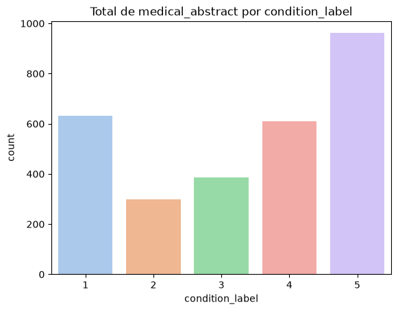

# 🎲 Modelagem — Análise dos dados

## Dataset

**Medical Abstracts TC Corpus** — abstracts médicos com a descrição de uma doença
e sua categoria. Objetivo: **classificar a categoria da doença** a partir do texto.

| | colunas | linhas |
|---|---|---|
| `medical_tc_train.csv` | `condition_label`, `medical_abstract` | 11.550 |
| `medical_tc_test.csv` | `condition_label`, `medical_abstract` | 2.888 |
| `medical_tc_labels.csv` | `condition_label`, `condition_name` | 5 |

Arquivos versionados via **DVC** (`src/data/raw/*.csv.dvc`). Notebooks:
`EDA/analise_exploratoria.ipynb` e `notebooks/baseline.ipynb`.

## Distribuição das classes

| label | categoria | treino | teste | corpus |
|-------|-----------|-------:|------:|-------:|
| 1 | neoplasms | 2.530 | 633 | 3.163 |
| 2 | digestive system diseases | 1.195 | 299 | 1.494 |
| 3 | nervous system diseases | 1.540 | 385 | 1.925 |
| 4 | cardiovascular diseases | 2.441 | 610 | 3.051 |
| 5 | general pathological conditions | 3.844 | 961 | 4.805 |

### 🔍 Observação — desbalanceamento

Há diferença relevante de volumetria: a classe 5 tem ~3,2× a classe 2. Isso
enviesa o modelo para as classes majoritárias e derruba o recall das minoritárias.

## Decisões de modelagem

| Ponto | Decisão | Motivo |
|---|---|---|
| Limpeza | `clean_text` só com regex (minúsculas, sem colchetes/dígitos/pontuação) | modelo "leve" e retreino rápido; stopwords ficam no vetorizador |
| Vetorização | `TfidfVectorizer` `ngram_range=(1,2)`, `min_df=5`, `max_df=0.9`, `sublinear_tf=True` | bigramas capturam expressões clínicas ("blood pressure"); `min_df`/`max_df` cortam ruído e termos onipresentes |
| Balanceamento | `class_weight="balanced"` na Regressão Logística | ajusta o peso das classes sem inflar o dataset (mais estável que SMOTE em texto esparso) |
| Modelo | `LogisticRegression` (`C=0.3`) em `sklearn.Pipeline` | linear, rápido, `predict_proba` para a resposta da API, exportável para ONNX (Etapa 4) |
| Avaliação | hold-out estratificado 80/20 do `train.csv`; métrica principal F1-weighted | classes desbalanceadas → accuracy pura engana |

## Resultado

Baseline: **accuracy ≈ 0,62 / F1-weighted ≈ 0,60** no hold-out. Métricas por
classe e limitações em [model_card.md](./model_card.md).
