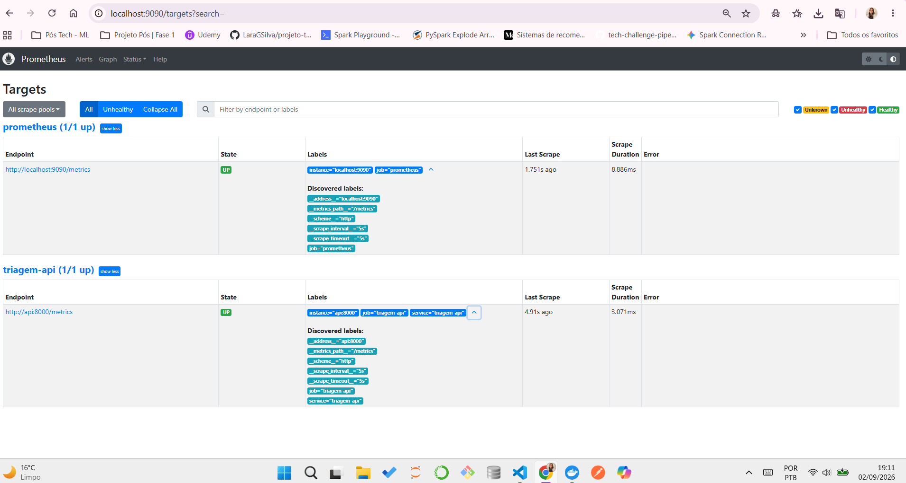
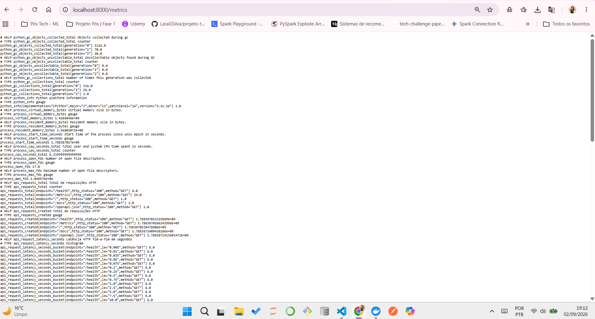
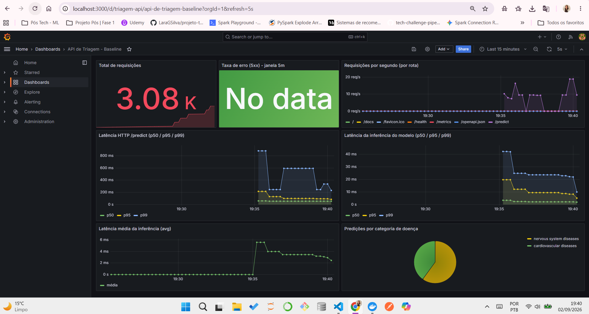

# Monitoramento — Prometheus + Grafana

## Objetivo

Observar a **saúde e a performance da API de inferência** em tempo real: volume de
requisições, taxa de erro, latência HTTP fim-a-fim, latência da inferência do
modelo (métrica isolada, usada como referência para a otimização da Etapa 4) e a
distribuição das classes previstas.

## Stack

`docker-compose.monitoring.yaml` sobe três serviços:

| Serviço | Imagem | Porta | Papel |
|---|---|---|---|
| `api` | build do `Dockerfile` | 8000 | expõe as métricas em `GET /metrics` |
| `prometheus` | `prom/prometheus:v2.54.1` | 9090 | coleta (scrape) e armazena as séries |
| `grafana` | `grafana/grafana:11.2.0` | 3000 | dashboards (datasource + painéis provisionados) |

```bash
docker compose -f docker-compose.monitoring.yaml up --build
# API .......... http://localhost:8000/  (UI) e /metrics
# Prometheus ... http://localhost:9090   (Status → Targets deve mostrar triagem-api UP)
# Grafana ...... http://localhost:3000   (admin / admin)
```

## 1. Instrumentação da API (`prometheus_client`)

Em `src/app/api.py`, um middleware HTTP mede toda requisição e um bloco no
`/predict` mede só a inferência. Métricas expostas:

| Métrica | Tipo | Labels | Uso |
|---|---|---|---|
| `api_requests_total` | Counter | `method`, `endpoint`, `http_status` | volume e taxa de erro por rota/status |
| `api_request_latency_seconds` | Histogram | `method`, `endpoint` | latência HTTP fim-a-fim (p50/p95/p99 via `histogram_quantile`) |
| `model_inference_latency_seconds` | Histogram | — | tempo gasto só em `model.predict` / `predict_proba` |
| `model_predictions_total` | Counter | `condition_label`, `condition_name` | quantas predições por categoria de doença |

O endpoint `GET /metrics` devolve o texto no formato de exposição do Prometheus
(`generate_latest()` / `CONTENT_TYPE_LATEST`).


## 2. Coleta — Prometheus (`monitoring/prometheus.yml`)

```yaml
global:
  scrape_interval: 5s
  evaluation_interval: 5s

scrape_configs:
  - job_name: triagem-api
    metrics_path: /metrics
    static_configs:
      - targets: ["api:8000"]        # nome do serviço na rede do compose
        labels:
          service: triagem-api
  - job_name: prometheus
    static_configs:
      - targets: ["localhost:9090"]  # auto-monitoramento
```


Prometheus faz *pull* de `http://api:8000/metrics` a cada 5 s e guarda as séries
temporais (retenção de 7 dias, definida no `command` do serviço).


## 3. Visualização — Grafana (provisionamento)

Nada é configurado na mão; tudo em `monitoring/grafana/`:

- **Datasource** (`provisioning/datasources/datasource.yml`): Prometheus em
  `http://prometheus:9090`, `uid: prometheus`, marcado como default.
- **Provider de dashboards** (`provisioning/dashboards/provider.yml`): carrega
  todo JSON de `/var/lib/grafana/dashboards` (montado de
  `monitoring/grafana/dashboards/`).
- **Dashboard** (`dashboards/api_triagem.json`): "API de Triagem - Baseline",
  `uid: triagem-api`, refresh 5 s, 7 painéis.

### Painéis do dashboard

| # | Painel | Query PromQL |
|---|---|---|
| 1 | Total de requisições (stat) | `sum(api_requests_total)` |
| 2 | Taxa de erro 5xx – 5m (stat) | `sum(rate(api_requests_total{http_status=~"5.."}[5m])) / clamp_min(sum(rate(api_requests_total[5m])), 0.001)` |
| 3 | Requisições/s por rota (timeseries) | `sum by (endpoint) (rate(api_requests_total[1m]))` |
| 4 | Latência HTTP `/predict` p50/p95/p99 | `histogram_quantile(0.95, sum by (le) (rate(api_request_latency_seconds_bucket{endpoint="/predict"}[5m])))` |
| 5 | Latência da inferência do modelo p50/p95/p99 | `histogram_quantile(0.95, sum by (le) (rate(model_inference_latency_seconds_bucket[5m])))` |
| 6 | Latência média da inferência | `rate(model_inference_latency_seconds_sum[5m]) / clamp_min(rate(model_inference_latency_seconds_count[5m]), 0.001)` |
| 7 | Predições por categoria (piechart) | `sum by (condition_name) (model_predictions_total)` |

Requisitos do desafio atendidos: dashboard com ≥ 3 painéis cobrindo **total de
requisições** (1), **latência / tempo de resposta** (4, 5, 6) e **taxa de erro**
(2).



### Gerando carga para ver os gráficos

```bash
uv run python scripts/bench_latency.py --n 1000 --concurrency 10
```

## 4. Baseline de latência (referência para a Etapa 4)

`model_inference_latency_seconds` isola o custo do modelo (~2–3 ms local). A
diferença para a latência fim-a-fim (`api_request_latency_seconds`) é overhead de
HTTP/framework/rede. Números registrados em `benchmarks/README.md`; a comparação
"antes × depois" da otimização (ONNX/quantização) deve usar essa métrica.

## 5. JSON do dashboard do Grafana

Arquivo: `monitoring/grafana/dashboards/api_triagem.json`

```json
{
  "uid": "triagem-api",
  "title": "API de Triagem - Baseline",
  "tags": ["triagem", "nlp", "baseline"],
  "timezone": "browser",
  "schemaVersion": 39,
  "version": 1,
  "refresh": "5s",
  "time": { "from": "now-15m", "to": "now" },
  "templating": { "list": [] },
  "annotations": { "list": [] },
  "panels": [
    {
      "id": 1,
      "type": "stat",
      "title": "Total de requisições",
      "gridPos": { "h": 6, "w": 6, "x": 0, "y": 0 },
      "datasource": { "type": "prometheus", "uid": "prometheus" },
      "fieldConfig": { "defaults": { "unit": "short", "color": { "mode": "thresholds" } }, "overrides": [] },
      "options": { "reduceOptions": { "calcs": ["lastNotNull"] }, "colorMode": "value", "graphMode": "area" },
      "targets": [
        {
          "refId": "A",
          "datasource": { "type": "prometheus", "uid": "prometheus" },
          "expr": "sum(api_requests_total)",
          "legendFormat": "requisições"
        }
      ]
    },
    {
      "id": 2,
      "type": "stat",
      "title": "Taxa de erro (5xx) - janela 5m",
      "gridPos": { "h": 6, "w": 6, "x": 6, "y": 0 },
      "datasource": { "type": "prometheus", "uid": "prometheus" },
      "fieldConfig": {
        "defaults": {
          "unit": "percentunit",
          "min": 0,
          "max": 1,
          "thresholds": { "mode": "absolute", "steps": [
            { "color": "green", "value": null },
            { "color": "orange", "value": 0.01 },
            { "color": "red", "value": 0.05 }
          ] }
        },
        "overrides": []
      },
      "options": { "reduceOptions": { "calcs": ["lastNotNull"] }, "colorMode": "background", "graphMode": "none" },
      "targets": [
        {
          "refId": "A",
          "datasource": { "type": "prometheus", "uid": "prometheus" },
          "expr": "sum(rate(api_requests_total{http_status=~\"5..\"}[5m])) / clamp_min(sum(rate(api_requests_total[5m])), 0.001)",
          "legendFormat": "erro"
        }
      ]
    },
    {
      "id": 3,
      "type": "timeseries",
      "title": "Requisições por segundo (por rota)",
      "gridPos": { "h": 6, "w": 12, "x": 12, "y": 0 },
      "datasource": { "type": "prometheus", "uid": "prometheus" },
      "fieldConfig": { "defaults": { "unit": "reqps", "custom": { "drawStyle": "line", "fillOpacity": 10 } }, "overrides": [] },
      "options": { "legend": { "displayMode": "list", "placement": "bottom" }, "tooltip": { "mode": "multi" } },
      "targets": [
        {
          "refId": "A",
          "datasource": { "type": "prometheus", "uid": "prometheus" },
          "expr": "sum by (endpoint) (rate(api_requests_total[1m]))",
          "legendFormat": "{{endpoint}}"
        }
      ]
    },
    {
      "id": 4,
      "type": "timeseries",
      "title": "Latência HTTP /predict (p50 / p95 / p99)",
      "gridPos": { "h": 8, "w": 12, "x": 0, "y": 6 },
      "datasource": { "type": "prometheus", "uid": "prometheus" },
      "fieldConfig": { "defaults": { "unit": "s", "custom": { "drawStyle": "line", "fillOpacity": 10 } }, "overrides": [] },
      "options": { "legend": { "displayMode": "list", "placement": "bottom" }, "tooltip": { "mode": "multi" } },
      "targets": [
        {
          "refId": "A",
          "datasource": { "type": "prometheus", "uid": "prometheus" },
          "expr": "histogram_quantile(0.50, sum by (le) (rate(api_request_latency_seconds_bucket{endpoint=\"/predict\"}[5m])))",
          "legendFormat": "p50"
        },
        {
          "refId": "B",
          "datasource": { "type": "prometheus", "uid": "prometheus" },
          "expr": "histogram_quantile(0.95, sum by (le) (rate(api_request_latency_seconds_bucket{endpoint=\"/predict\"}[5m])))",
          "legendFormat": "p95"
        },
        {
          "refId": "C",
          "datasource": { "type": "prometheus", "uid": "prometheus" },
          "expr": "histogram_quantile(0.99, sum by (le) (rate(api_request_latency_seconds_bucket{endpoint=\"/predict\"}[5m])))",
          "legendFormat": "p99"
        }
      ]
    },
    {
      "id": 5,
      "type": "timeseries",
      "title": "Latência da inferência do modelo (p50 / p95 / p99)",
      "gridPos": { "h": 8, "w": 12, "x": 12, "y": 6 },
      "datasource": { "type": "prometheus", "uid": "prometheus" },
      "fieldConfig": { "defaults": { "unit": "s", "custom": { "drawStyle": "line", "fillOpacity": 10 } }, "overrides": [] },
      "options": { "legend": { "displayMode": "list", "placement": "bottom" }, "tooltip": { "mode": "multi" } },
      "targets": [
        {
          "refId": "A",
          "datasource": { "type": "prometheus", "uid": "prometheus" },
          "expr": "histogram_quantile(0.50, sum by (le) (rate(model_inference_latency_seconds_bucket[5m])))",
          "legendFormat": "p50"
        },
        {
          "refId": "B",
          "datasource": { "type": "prometheus", "uid": "prometheus" },
          "expr": "histogram_quantile(0.95, sum by (le) (rate(model_inference_latency_seconds_bucket[5m])))",
          "legendFormat": "p95"
        },
        {
          "refId": "C",
          "datasource": { "type": "prometheus", "uid": "prometheus" },
          "expr": "histogram_quantile(0.99, sum by (le) (rate(model_inference_latency_seconds_bucket[5m])))",
          "legendFormat": "p99"
        }
      ]
    },
    {
      "id": 6,
      "type": "timeseries",
      "title": "Latência média da inferência (avg)",
      "gridPos": { "h": 6, "w": 12, "x": 0, "y": 14 },
      "datasource": { "type": "prometheus", "uid": "prometheus" },
      "fieldConfig": { "defaults": { "unit": "s" }, "overrides": [] },
      "options": { "legend": { "displayMode": "list", "placement": "bottom" }, "tooltip": { "mode": "single" } },
      "targets": [
        {
          "refId": "A",
          "datasource": { "type": "prometheus", "uid": "prometheus" },
          "expr": "rate(model_inference_latency_seconds_sum[5m]) / clamp_min(rate(model_inference_latency_seconds_count[5m]), 0.001)",
          "legendFormat": "média"
        }
      ]
    },
    {
      "id": 7,
      "type": "piechart",
      "title": "Predições por categoria de doença",
      "gridPos": { "h": 6, "w": 12, "x": 12, "y": 14 },
      "datasource": { "type": "prometheus", "uid": "prometheus" },
      "fieldConfig": { "defaults": { "unit": "short" }, "overrides": [] },
      "options": { "legend": { "displayMode": "list", "placement": "right" }, "reduceOptions": { "calcs": ["lastNotNull"] } },
      "targets": [
        {
          "refId": "A",
          "datasource": { "type": "prometheus", "uid": "prometheus" },
          "expr": "sum by (condition_name) (model_predictions_total)",
          "legendFormat": "{{condition_name}}"
        }
      ]
    }
  ]
}
```
